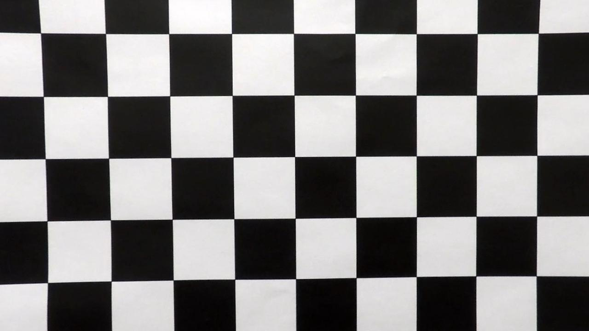
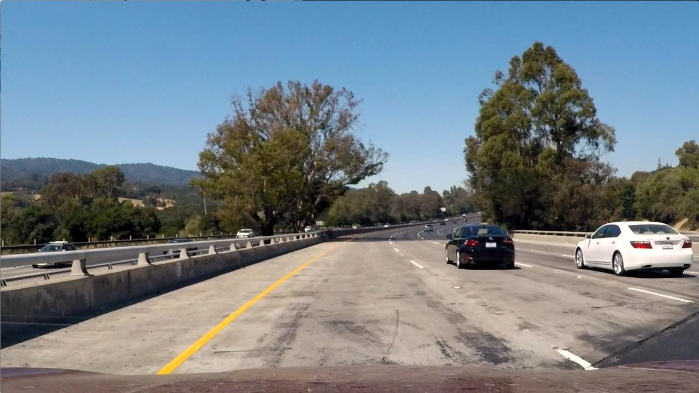
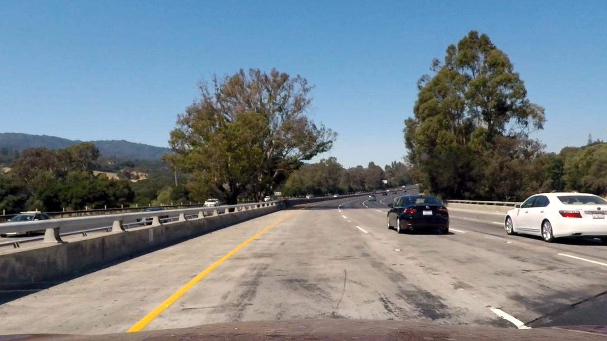
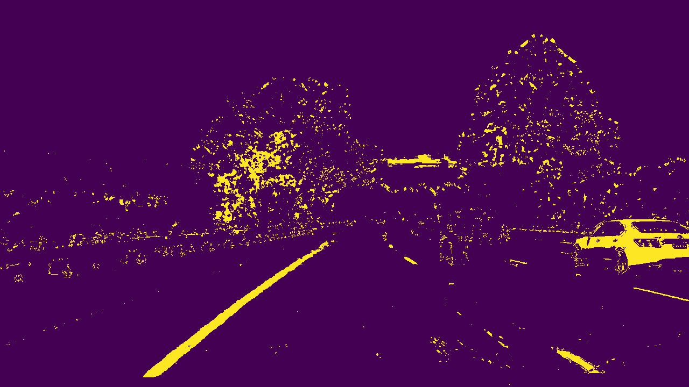
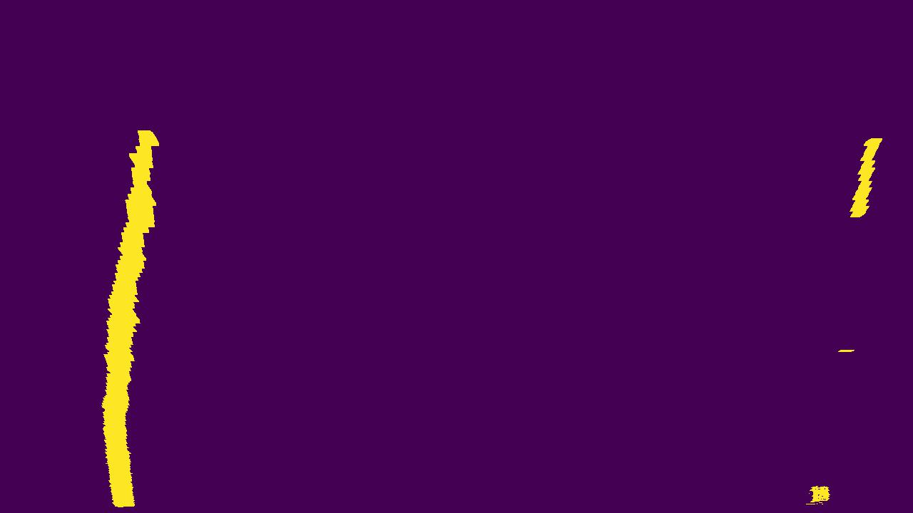
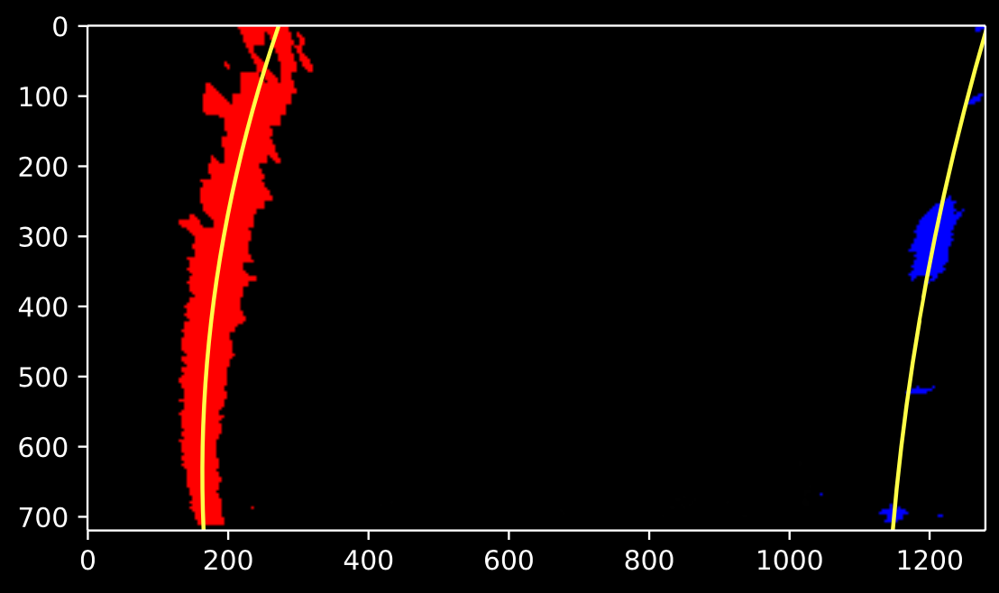

# Project 2 - Advanced Lane Finding
This project from Udacity‘s Self-Driving Car Engineer Nanodegree program deepens lane finding techniques. This includes better lane line detection on shady roads, brighter road surfaces (compared to the first lane line finding project) and higher polynomial lines. It also introduces camera calibration and image distortion correction. 
- - - -
## 1 - Project Overview

### Goals:
* Compute the camera calibration matrix and distortion coefficients given a set of chessboard images.
* Apply a distortion correction to raw images.
* Use color transforms, gradients, etc., to create a thresholded binary image.
* Apply a perspective transform to rectify binary image ("birds-eye view").
* Detect lane pixels and fit to find the lane boundary.
* Determine the curvature of the lane and vehicle position with respect to center.
* Warp the detected lane boundaries back onto the original image.
* Output visual display of the lane boundaries and numerical estimation of lane curvature and vehicle position.
* Apply all these steps to a test video.

### Structure:
The code is divided into the `Advanced_Lane_Finding.py` and the `helpers.py`. The `Advanced_Lane_Finding.py` contains the main structure and the frame processing pipeline including the update task and sanity checks. Inside the `helpers.py` are all needed functions for the pipeline and camera calibration. 

- - - -
## 2 - Rubric Points
Here I will consider the [rubric points](https://review.udacity.com/#!/rubrics/571/view) individually and describe how I addressed each point in my implementation.  

### 2.1 - Camera Calibration

#### 1. Briefly state how you computed the camera matrix and distortion coefficients. Provide an example of a distortion corrected calibration image.

The camera calibration is called from the `Advanced_Lane_Finding.py` in line 80 as  `calibrateCamera()`. This function is implemented in the `helpers.py` file. Subsequently  `helpers.X()`  will indicate, that the function `X()` is implemented in the `helpers.py` file.

In the function `helpers.calibrateCamera()` itself (lines 13-48) I first read in the calibration images using the `glob`-library. Then I prepare the „object points“ which represent the chessboard corners coordinates as a 9x6 matrix ((0,0,0), (1,0,0), (2,0,0) ...). Here I am assuming that the chessboards are fixed on the z=0 layer. After preparing the object points I loop over all the calibration images. For each image I append the `objp` to the `obj_points` list and the x and y coordinates `corners`, the detected corners on the calibration image, to the `img_points` list. To find `corners` I used the OpenCV function `cv2.findChessboardCorners()` (line 40).  Finally the function returns the `obj_points` and `img_points`. 
For distortion correction I implemented a separate function called `helpers.undistortImage()` (lines 50-67) that takes in an distorted image and the `obj_points` and `img_points` from the `helpers.calibrateCamera()` function, and returns an distortion corrected image. It should be mentioned, that the distorted image must been take by the same camera as the calibration images. To calculate the camera matrix and the distortion coefficients I used the OpenCV function `cv2.calibrateCamera()` (line 61) and then correct the distortion with the OpenCV function `cv2.undistort()` (line 64). 

An result from these two functions could look like this:


### 2.2 - Pipeline (single images)

#### 1. Provide an example of a distortion-corrected image.

To demonstrate the distortion correction, I provide an distortion-corrected test image (Image 2):


Image 1 - Original

Image 2 - Distortion-corrected image

#### 2. Describe how (and identify where in your code) you used color transforms, gradients or other methods to create a thresholded binary image.  Provide an example of a binary image result.

I used a combination of color and gradient thresholds to generate a binary image with the `helpers/create_thresholded_binary_image()` function (lines 140-177). This function uses 3 additional helper functions: `helpers.abs_sobel_thresh()`, `helpers.mag_thresh()` and `helpers.dir_threshold()`. 

**Color based threshold**
For the color based threshold I will use following thresholds, obtained by testing:
```python
s_threshold = [100, 255]     # Saturation
white_threshold = [200, 255] # White
yellow_threshold = [14, 25]  # Yellow
```
First I extract the saturation channel from a HSL converted image (line 151). Then I prepare a white & yellow mask (lines 153-157):
```python
# Extract hue and lightness channels from HLS 
h = hls[:,:,0]
l = hls[:,:,1]
white_mask = (l > white_threshold[0]) & (l <= white_threshold[1])
yellow_mask = (h > yellow_threshold[0]) & (h <= yellow_threshold[1])
```
After preparing a saturation mask (line 160), I binary OR combine the white and yellow mask and binary AND combine this with the saturation mask. This results in an color based saturation mask.

**Gradient based threshold**
In addition to the color based threshold I applied a gradient based threshold. I used the value channel from the HSV converted image through the better brightness differences compared to greyscaled images. 
To be more precise: I used a x and y direction absolute gradient threshold (lines 69-89, `helpers.abs_sobel_thresh()`) and a gradient magnitude and direction based threshold (lines 93-138, `helpers.mag_thresh()` & `helpers.dir_threshold()`). These two Sobel thresholds detect edges in the image. To apply the Sobel operator I used OpenCV‘s function `cv2.Sobel()`. The absolute Sobel thresholds are calculated as the absolute value (`np.absolute()`)  of the `cv2.Sobel()` output. The binary AND combination of x and y direction returns reasonable results for lane lines. The magnitude is calculated as the square root of the sum of squares of the x and y gradients (lines 104-108, `helper.py`):
```python
# Take the gradient in x and y separately
sobelx = cv2.Sobel(v, cv2.CV_64F, 1, 0, ksize=sobel_kernel)
sobely = cv2.Sobel(v, cv2.CV_64F, 0, 1, ksize=sobel_kernel)
# Calculate the magnitude 
magnitude = np.sqrt(sobelx ** 2 + sobely ** 2)
```
The direction of the gradient is calculated as the arc tangent of the absolute x and y direction gradients (lines 127-134, `helper.py`):
```python
# Take the gradient in x and y separately
xSobel = cv2.Sobel(v, cv2.CV_64F, 1, 0, ksize=sobel_kernel)
ySobel = cv2.Sobel(v, cv2.CV_64F, 0, 1, ksize=sobel_kernel)
# Take the absolute value of the x and y gradients
x_abs = np.absolute(xSobel)
y_abs = np.absolute(ySobel)
# Use np.arctan2(abs_sobely, abs_sobelx) to calculate the 
# direction of the gradient 
direction = np.arctan2(y_abs, x_abs)
```
The binary AND combination of magnitude and direction gradients returns again reasonable line edge results. 
I used following threshold values (obtained by testing):
	* Absolute gradient in x direction: 30 to 100
	* Absolute gradient in y direction: 40 to 100
	* Magnitude: 40 to 100 
	* Direction: 0.7 to 1.1

The binary OR combination of color based threshold, absolute gradient threshold and magnitude-direction threshold form the thresholded binary image (lines 173-175, `helpers.py`). An example is provided below:



#### 3. Describe how (and identify where in your code) you performed a perspective transform and provide an example of a transformed image.

The code for perspective transform is included in the function `helpers.transform_road()` (lines 179-201, `helpers.py`). This function takes as input a binary thresholded image (`binary_image`) and returns a perspective transformed image and the inverse matrix to undo the transformation later on. 
I chose hardcoded source and destination points as following:
```python
# Source points
src = np.float32([
	[565, 460], [725, 460], [90, ysize], [xsize, ysize]
])
# Destination points
dest = np.float32([
	[0,0], [xsize,0], [0, ysize], [xsize,ysize]
])
```
I verified the points by drawing lines connecting the points and checking parallelism.

To calculate the transformation matrix and the inverse matrix I used the OpenCV function `cv2.getPerspectiveTransform()` (lines 197 & 198). 
In order to apply the transformation I used the `cv2.warpPerspective()` function which returns the warped image. An example output you can see bellow:


#### 4. Describe how (and identify where in your code) you identified lane-line pixels and fit their positions with a polynomial?

To identify lane-line pixels I made two different approaches. If there is a-priori data from prior frames the next lane lines will be searched within the prior polynomial fit as implemented in the `helpers.find_pixels_by_prior()` function (lines 289-317). If not, the pixels have to be found by another approach. I chose the histogram analysis technique in the `helpers.find_pixels_by_histogram()` function (lines 203-269). Bellow you can see the histogram of the lowest 10th of the image:


There are two significant spikes which probably represent the lane lines in this  10th of the image. After choosing the maximal value of the left and right half and selecting all nonzero pixels within a margin (100 pixels) left and right, I checked if there are enough pixels (`minpx = 50`): 
```Python
if (len(good_left_inds) >= minpx):
	current_leftx = np.int(sum(nonzeroX[good_left_inds])/
				len(nonzeroX[good_left_inds]))
if (len(good_right_inds) >= minpx):
	current_rightx = np.int(sum(nonzeroX[good_right_inds])/
				len(nonzeroX[good_right_inds]))
```
Lines 254-257, `helpers.py`.

If there are enough pixels detected, the x value of the next search window (height of tenth and width of two times margin) is changed to the mean of the detected pixel x values. Nevertheless the identified pixels were added to the total left x and y pixel lists and right x and y pixel lists.
This procedure is repeated for the other nine 10th of the image from the bottom to top.
The `helpers.find_pixels_by_histogram()` returns the resulting left x and y pixel coordinates and the right x and y pixel coordinates.

After collecting the needed pixels the both functions `helpers.fit_poly()` (lines 271-278) and `helpers.fit_poly_pixel()` (lines 280-287) can now calculate the 2nd order polynomial just by calling the Numpy function `np.polyfit()` function. Both fit_poly functions return the parameters for the 2nd order polynomial for both lane lines. In the `helpers.fit_poly()` function I also considered the conversion from pixel to meters.

The visualized result of the functions could look like this:


#### 5. Describe how (and identify where in your code) you calculated the radius of curvature of the lane and the position of the vehicle with respect to center.

I calculated the radius of curvature of the lane as the mean of the left and right line‘s curvatures in the `helpers.get_lane_curvature()` function (lines 348-352).
To accomplish this, the radii of curvature of the left and right line needed to be calculated. This is done in the `helpers.calc_curvature()` function (lines 319-346). The function first calculates the polynomial fits for both lines by calling the `helpers.fit_poly()` function and then the radius of curvature for each line (lines 331-333):
```python
# Left and right lane curvature calculation
left_curvature = np.sqrt((1 + (2*left_fit[0]*y_eval + left_fit[1])**2)**3) / np.abs(2*left_fit[0])
right_curvature = np.sqrt((1 + (2*right_fit[0]*y_eval + right_fit[1])**2)**3) / np.abs(2*right_fit[0])
```

Besides that `helpers.calc_curvature()` also calculates the current x position of the polynomial fit of both lines at the bottom of the image (and so at the car)(lines 335-337):
```python
## Position calculation
left_current_x = left_fit[0] * y_eval ** 2 + left_fit[1] * y_eval + left_fit[2]
right_current_x = right_fit[0] * y_eval ** 2 + right_fit[1] * y_eval + right_fit[2]
```

These values are need for the offset calculation implemented in the `get_car_offset()` function (lines 354-369). Since we can assume, that the camera is mounted in the center of the car, the offset can be calculated by following code:
```python
# calculate x-value of center of lane at bottom of image (at cars position)
lane_center_x = (right_line_x+left_line_x)/2

# Offset calculation
car_center = width * xm_per_pix / 2
car_offset = car_center - (lane_center_x)
```

#### 6. Provide an example image of your result plotted back down onto the road such that the lane area is identified clearly.

I implemented this step in the `helpers.warp_back_results()` function (lines 371-416). This function also takes as input in inverse matrix calculated earlier on. Here is an example of my result on a test image:


- - - -

### Pipeline (video)

#### 1. Provide a link to your final video output.  Your pipeline should perform reasonably well on the entire project video (wobbly lines are ok but no catastrophic failures that would cause the car to drive off the road!).

Here's a [link to my video result](output_videos/project_done.mp4).

- - - -

### Discussion

#### 1. Briefly discuss any problems / issues you faced in your implementation of this project.  Where will your pipeline likely fail?  What could you do to make it more robust?

I started with a Jupyter notebook and implemented the need functions. Then I testes them on the given test images and optimized the parameters (binary thresholds, kernel size, ...). Next I transferred my code to normal .py scripts and fixed the first problems with my implementation. After testing my pipeline on a video I faced some severe problems with the binary thresholding that will cause the car to drive off the road. The implementation of the already mentioned white/yellow threshold made the pipeline work reliable. Additionally I had to change the window of interest (src points) because this also increases the accuracy. Finally the update mechanism had to be improved since there were not enough updates and the calculated radii and offsets froze over a lot of frames.

Currently the update mechanism could be improved further to minimize the freezing calculations so the lane detection will be more reliable. I am open for suggestions at this point. 
The pipeline will fail, if the saturation of the lane lines are very low. This will result in not enough pixels detected. A possible improvement would be the extra usage of the value channel which is more reliable in shadows. Another problem are edges of asphalt that are recognized as lane lines. Here could a yellow/white threshold optimize the dependability of the correct line detection.
The update mechanism as implemented as it is will cause problems with sharp bends. An optimized sanity check should address this issue.
